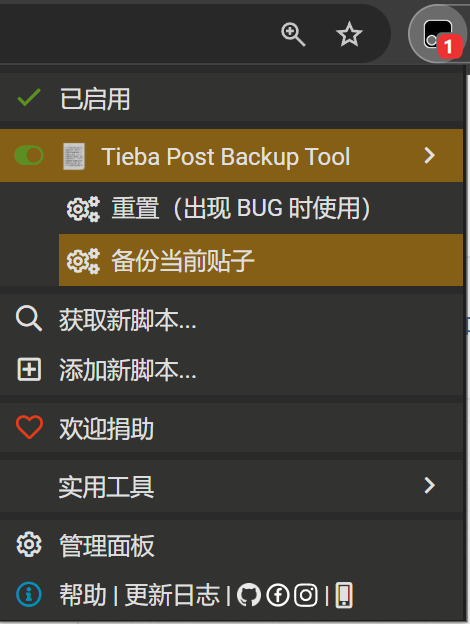

# Tieba Post Backup Tool （百度贴吧贴子备份工具）

不定期更新。

[【百度贴吧贴子备份工具-演示】](https://www.bilibili.com/video/BV1A8NteREva/?share_source=copy_web&vd_source=34d2dac1f41bd4ca259dd99a9bbdc8b2)

## 构建
1. `npm install`
2. `npm run build`
3. 输出脚本文件位于 `dist` 文件夹下

## 使用方式
1. 手动构建，或从 [Greasy Fork](https://greasyfork.org/scripts/526166-tieba-post-backup-tool) 下载脚本。
2. 使用 [TamperMonkey](https://www.tampermonkey.net/) 安装脚本。
3. 打开想要备份的贴子。
4. 打开脚本管理器的菜单。
5. 点击 `备份当前贴子`，等待备份操作完成。
6. 完成后，脚本会弹出消息框，提示备份成功。

## TODO
- [ ] 修复换行丢失的问题
- [ ] 改进图片和文字的混排
- [ ] 改进 HTML tag 的处理算法（见 [Markdown.ts](./src/Markdown.ts) 函数 `_ResolveTags`）
- [ ] 改进楼中楼评论的解析算法（目前每层楼最多只能保存十条楼中楼评论）
- [ ] 支持仅备份指定页
- [ ] 改进备份结果的显示
    - 目前的 markdown 有点简陋，并没有很好地体现贴吧的 “风格”
    - 可以考虑设计一套专门的存储格式，将备份数据的存储与显示解耦，以便后续对于显示效果的持续更新

## FAQ
### 为什么要做成脚本的形式？不能像爬虫那样自动爬取吗？
- 主要有以下两个方面的考虑。
    - 从技术的角度讲，传统爬虫并不能获得贴子的全部信息，因为贴子是动态加载的（*待确认，有时候好像并非如此*），只有你滚动到了对应的楼层才会加载对应的贴子，而使用 Selenium 之类的工具又太过笨重，因此才选择相对简单的方案，即直接在浏览器里跑脚本。
    - 从安全的角度来讲，贴吧在未登录的情况下能够获取的信息比较有限（貌似只能看第一页的贴子），如果做成自动化程度更高的工具，可能会要求用户预先输入账密登录，带来一定的安全隐患。我个人也不太喜欢使用需要输入账密的工具。
